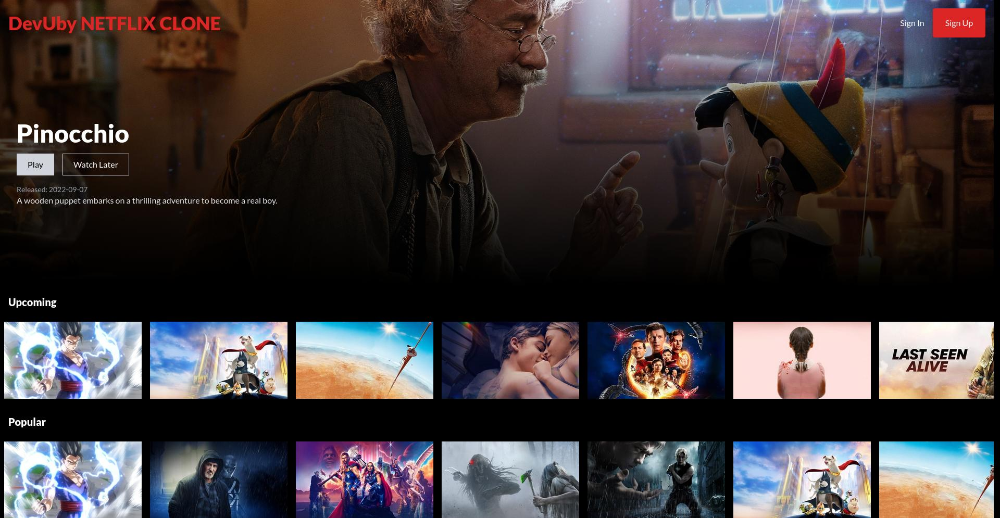
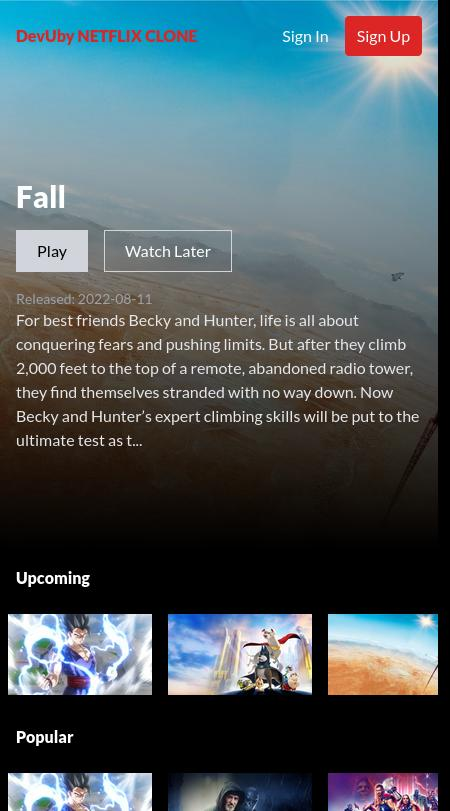

<div align="center">
  <h2 align="center">Dev Uby Netflix Clone</h2>

Dev Uby Netflix Clone is a project for learning the concepts of React[https://reactjs.org/], [Tailwind](https://tailwindcss.com/) and [Firebase](https://firebase.google.com/) by rebuilding some pages of [Netflix](https://www.netflix.com/) using [The Movie Database API](https://www.themoviedb.org/), <br />Responsive for all devices

## <a href="https://neflix-clone-react-tailwind.web.app"><strong>➥ Run a Live Demo Of This Project </strong></a>

</div>

<br />

### Demo Screenshots

<div background-color="red" >

<br/>
<br/>

</div>

### Credit and Acknowledgment

This repo is a modified build of the Video linked below and was created to learn the technologies alreaddy listed above. Most Credits goes to the YouTube Channel linked below

- [YouTube Video Link](https://youtu.be/ATz8wg6sg30)
- [YouTube Channel Link](https://www.youtube.com/channel/UCmT9TwcIb_yAe7-Uqhn3fBA)

<br/>

### Prerequisites

Before you begin, ensure you have met the following requirements:

- [Git](https://git-scm.com/downloads 'Download Git') must be installed on your operating system.

### Run Locally

To run **Dev Uby Netflix Clone** locally, run this command on your git bash:

Linux and macOS:

```bash
sudo git clone https://github.com/UbongJacob/netflix_clone_react_firebase_tailwind.git
```

Windows:

```bash
git clone https://github.com/UbongJacob/netflix_clone_react_firebase_tailwind.git
```

In the project directory, you can run:

### `yarn`
To install all the required dependencies

### `yarn start`

Runs the app in the development mode.\
Open [http://localhost:3000](http://localhost:3000) to view it in your browser.

### <a href="https://neflix-clone-react-tailwind.web.appp"><strong>➥ Live Demo</strong></a>

### Contact or Connect with me:

If you want to contact with me you can reach me at [Twitter](https://www.twitter.com/ubonggjacob) or [Linkedin](https://www.linkedin.com/in/ubonggjacob)
<br />
<a href = "https://www.linkedin.com/in/ubonggjacob"></a>
<a href = "https://twitter.com/UbonggJacob"></a>

### License

This project is **free to use** and does not contains any license. Once again most intellectual property right is refrenced on the credit section above


